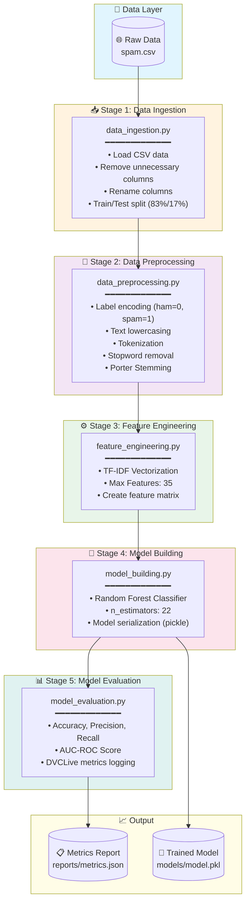
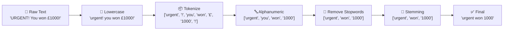

# 📧 SMS Spam Classification Pipeline

A complete end-to-end Machine Learning pipeline for SMS spam detection using **Natural Language Processing (NLP)** techniques with **DVC (Data Version Control)** for experiment tracking and reproducibility.


---

## 📋 Table of Contents

- [Project Overview](#-project-overview)
- [Pipeline Architecture](#-pipeline-architecture)
- [Model Performance](#-model-performance)
- [Project Structure](#-project-structure)
- [Installation](#-installation)
- [Usage](#-usage)
- [Configuration](#-configuration)
- [Experiment Tracking](#-experiment-tracking)

---

## 🎯 Project Overview

This project implements a **SMS Spam Classification** system that automatically detects whether a text message is **spam** or **ham (legitimate)**. The pipeline uses:

- **TF-IDF Vectorization** for feature extraction
- **Random Forest Classifier** for prediction
- **DVC** for pipeline management and experiment tracking
- **DVCLive** for real-time metrics logging

### Sample Data

| Target | Text Message |
|--------|-------------|
| 🟢 ham | "Our Prasanth ettans mother passed away last night. Just pray for her and family." |
| 🟢 ham | "Don't forget though that I love you.... And I walk beside you." |
| 🔴 spam | "GENT! We are trying to contact you. Last weekends draw shows that you won a £1000 prize GUARANTEED. Call 09064012160" |
| 🔴 spam | "Hard LIVE 121 chat just 60p/min. Choose your girl and connect LIVE." |

---

## 🔄 Pipeline Architecture



### Pipeline Stages Flow

```
┌─────────────────────────────────────────────────────────────────────────────────────┐
│                              DVC PIPELINE EXECUTION                                  │
├─────────────────────────────────────────────────────────────────────────────────────┤
│                                                                                      │
│   ┌──────────────┐    ┌──────────────┐    ┌──────────────┐    ┌──────────────┐      │
│   │    DATA      │    │   INTERIM    │    │  PROCESSED   │    │    MODEL     │      │
│   │    /raw      │───▶│    /data     │───▶│   /data      │───▶│   /models    │      │
│   │              │    │              │    │              │    │              │      │
│   │ • train.csv  │    │ • train_     │    │ • train_     │    │ • model.pkl  │      │
│   │ • test.csv   │    │   processed  │    │   tfidf.csv  │    │              │      │
│   │              │    │ • test_      │    │ • test_      │    │              │      │
│   │              │    │   processed  │    │   tfidf.csv  │    │              │      │
│   └──────────────┘    └──────────────┘    └──────────────┘    └──────────────┘      │
│          │                   │                   │                   │              │
│          ▼                   ▼                   ▼                   ▼              │
│   ┌──────────────────────────────────────────────────────────────────────────┐      │
│   │                         params.yaml (Configuration)                       │      │
│   │   • test_size: 0.17  • max_features: 35  • n_estimators: 22              │      │
│   └──────────────────────────────────────────────────────────────────────────┘      │
│                                                                                      │
└─────────────────────────────────────────────────────────────────────────────────────┘
```

---

## 📊 Model Performance

### Experiment Results

The model achieves excellent performance on the SMS spam detection task:

| Metric | Score | Visual |
|--------|-------|--------|
| **Accuracy** | 94.35% |  |
| **Precision** | 86.67% |  |
| **Recall** | 70.00% |  |
| **AUC-ROC** | 91.10% |  |

### Metrics Summary

```
┌────────────────────────────────────────────────────────────────────┐
│                    MODEL PERFORMANCE DASHBOARD                      │
├────────────────────────────────────────────────────────────────────┤
│                                                                     │
│   ACCURACY          ████████████████████████████████░░░░  94.35%   │
│                                                                     │
│   PRECISION         ██████████████████████████████░░░░░░  86.67%   │
│                                                                     │
│   RECALL            ████████████████████████░░░░░░░░░░░░  70.00%   │
│                                                                     │
│   AUC-ROC           ███████████████████████████████░░░░░  91.10%   │
│                                                                     │
└────────────────────────────────────────────────────────────────────┘
```

### Confusion Matrix Interpretation

```
                    Predicted
                 Ham    │   Spam
              ─────────┼──────────
        Ham  │   TN     │    FP    │  
Actual       │  (High)  │  (Low)   │  → High Specificity
              ─────────┼──────────
       Spam  │   FN     │    TP    │
             │  (Some)  │  (Good)  │  → 70% Recall
              ─────────┴──────────
                  ↓          ↓
            Low False   86.67% of spam
            Positives   predictions correct
```

---

## 📁 Project Structure

```
day5_vikas_das_prc/
│
├── 📄 dvc.yaml                    # DVC pipeline definition
├── 📄 params.yaml                 # Hyperparameters configuration
├── 📄 README.md                   # Project documentation
│
├── 📂 data/
│   ├── 📂 raw/                    # Original train/test splits
│   │   ├── train.csv              # 4,627 samples
│   │   └── test.csv               # ~947 samples
│   │
│   ├── 📂 interim/                # Preprocessed data
│   │   ├── train_processed.csv    # Cleaned & stemmed text
│   │   └── test_processed.csv
│   │
│   └── 📂 processed/              # Feature engineered data
│       ├── train_tfidf.csv        # TF-IDF vectors
│       └── test_tfidf.csv
│
├── 📂 src/                        # Source code modules
│   ├── data_ingestion.py          # Stage 1: Data loading
│   ├── data_preprocessing.py      # Stage 2: Text preprocessing
│   ├── feature_engineering.py     # Stage 3: TF-IDF extraction
│   ├── model_building.py          # Stage 4: Model training
│   └── model_evaluation.py        # Stage 5: Metrics evaluation
│
├── 📂 models/
│   └── model.pkl                  # Trained Random Forest model
│
├── 📂 reports/
│   └── metrics.json               # Final evaluation metrics
│
├── 📂 dvclive/                    # DVCLive experiment tracking
│   ├── metrics.json               # Live metrics
│   ├── params.yaml                # Tracked parameters
│   └── 📂 plots/
│       └── 📂 metrics/            # Metric history plots
│           ├── accuracy.tsv
│           ├── precision.tsv
│           └── recall.tsv
│
└── 📂 logs/                       # Application logs
    ├── data_ingestion.log
    ├── data_preprocessing.log
    ├── feature_engineering.log
    ├── model_building.log
    └── model_evaluation.log
```

---

## 🛠️ Installation

### Prerequisites

- Python 3.8+
- pip or conda

### Setup

1. **Clone the repository**
   ```bash
   git clone <repository-url>
   cd day5_vikas_das_prc
   ```

2. **Create virtual environment**
   ```bash
   python -m venv venv
   source venv/bin/activate  # Linux/Mac
   # OR
   .\venv\Scripts\activate  # Windows
   ```

3. **Install dependencies**
   ```bash
   pip install pandas scikit-learn nltk pyyaml dvclive dvc
   ```

4. **Download NLTK data**
   ```python
   import nltk
   nltk.download('stopwords')
   nltk.download('punkt')
   nltk.download('punkt_tab')
   ```

---

## 🚀 Usage

### Run Complete Pipeline

```bash
# Execute all pipeline stages
dvc repro
```

### Run Individual Stages

```bash
# Run specific stage
dvc repro data_ingestion
dvc repro data_preprocessing
dvc repro feature_engineering
dvc repro model_building
dvc repro model_evaluation
```

### Manual Execution

```bash
# Run each script individually
python src/data_ingestion.py
python src/data_preprocessing.py
python src/feature_engineering.py
python src/model_building.py
python src/model_evaluation.py
```

### View Pipeline DAG

```bash
dvc dag
```

Output:
```
     +----------------+  
     | data_ingestion |  
     +----------------+  
             *           
             *           
             *           
  +--------------------+   
  | data_preprocessing |   
  +--------------------+   
             *             
             *             
             *             
  +---------------------+    
  | feature_engineering |    
  +---------------------+    
             *               
             *               
             *               
    +----------------+       
    | model_building |       
    +----------------+       
             *               
             *               
             *               
   +------------------+      
   | model_evaluation |      
   +------------------+      
```

---

## ⚙️ Configuration

### params.yaml

All hyperparameters are centralized in `params.yaml`:

```yaml
# Data Ingestion Parameters
data_ingestion:
  test_size: 0.17          # 17% test set, 83% training set

# Feature Engineering Parameters
feature_engineering:
  max_features: 35         # Maximum TF-IDF features

# Model Building Parameters
model_building:
  n_estimators: 22         # Number of trees in Random Forest
  random_state: 5          # Reproducibility seed
```

### Parameter Tuning Guide

| Parameter | Description | Recommended Range |
|-----------|-------------|-------------------|
| `test_size` | Test set ratio | 0.15 - 0.25 |
| `max_features` | TF-IDF vocabulary size | 25 - 500 |
| `n_estimators` | Number of RF trees | 10 - 200 |
| `random_state` | Random seed | Any integer |

---

## 📈 Experiment Tracking

### DVCLive Metrics

The project uses **DVCLive** for real-time experiment tracking:

```python
from dvclive import Live

with Live(save_dvc_exp=True) as live:
    live.log_metric('accuracy', accuracy_score)
    live.log_metric('precision', precision_score)
    live.log_metric('recall', recall_score)
    live.log_params(params)
```

### View Experiments

```bash
# List all experiments
dvc exp show

# Compare experiments
dvc exp diff
```

### Metrics Location

| File | Content |
|------|---------|
| `reports/metrics.json` | Final evaluation metrics |
| `dvclive/metrics.json` | Live tracked metrics |
| `dvclive/plots/metrics/` | Metric history (TSV) |

---

## 🔬 Text Preprocessing Pipeline



---

## 📜 License

This project is for educational purposes.

---

## 👨‍💻 Author

**Vikas Das**

---

<div align="center">

### ⭐ Star this repository if you found it helpful!

</div>
